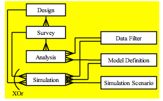

This is a brief example of how to use the `readdst` package to import all analyses and data from an existing [Distance for Windows](http://distancesampling.org/Distance) project.

## Preliminaries

I assume here that you have a Distance for Windows project file (in this case we're going to try out the "Golf Tees" example, which is shipped with Distance for Windows). This consists of a file called `Golftees.dst` and a folder named `Golftees.dat`. The folder can contain numerous other files (including R analyses, shapefiles, plots etc) but we'll ignore everything apart from the `DistData.mdb` file that contains the data used to fit our models.

To read the Access database files (the `.dst` file and `DistData.mdb` you need to have the `Hmisc` package installed and a copy of [`mdb-tools`](http://mdbtools.sourceforge.net/) installed on your computer. On Mac, if you have [`homebrew`](http://brew.sh/) installed, this consists of simply running `brew install mdb-tools`.

# General principle

`readdst` looks in the project `.dst` file, extracts the analyses, generates the correct calls to `ddf` and then runs those analyses, using the data it extracted from `DistData.mdb`. The various tables in the Distance for Windows databases relate in the following ways (source: Distance Developer's manual):



Although all of this is going on in the background, there are only a few functions one actually has to worry about.


# Golf tees

We begin by finding the golf tees project on our computer, since this project is shipped with `readdst` we can use `system.file` to find the path to it:

```{r}
library(readdst)
project <- system.file("Golftees-example", package="readdst")
project <- paste0(project,"/Golftees")
```

## Converting analyses

We can then convert the whole project and all analyses in it, this just translates the code that Distance uses to fit the model into R code:

```{r}
converted <- convert_project(project)
```

Note the warning generated here is because in the golf tees analysis, one data filter specifies distance bins outside of the truncation points.

We can see the names of the analyses (as they were given in Distance for Windows) and their analysis IDs by printing the returned object:

```{r}
converted
```

More detail (including the `mrds` call details) can be found by looking an individual element of the list:

```{r}
converted[[1]]
```

## Running analyses

We can run an individual analysis and look at its results (as it will return a `ds` object):

```{r}
analysis_1 <- run_analysis(converted[[1]], debug=TRUE)
summary(analysis_1)
```

Since this is just a fitted object from `mrds` we can do normal stuff like make plots:

```{r fig.cap="Plot results from `analysis_1`.", fig.width=9, fig.height=4}
par(mfrow=c(1,2))
plot(analysis_1)
```

If one wanted to run all the analysis at once, one could of course simply use `lapply`.

## Testing that Distance and R got the same answer

We can test the saved results in Distance against those from R using `test_stats`:

```{r}
test_stats(converted[[1]])
```

As we can see here, we did well and there were no differences!


